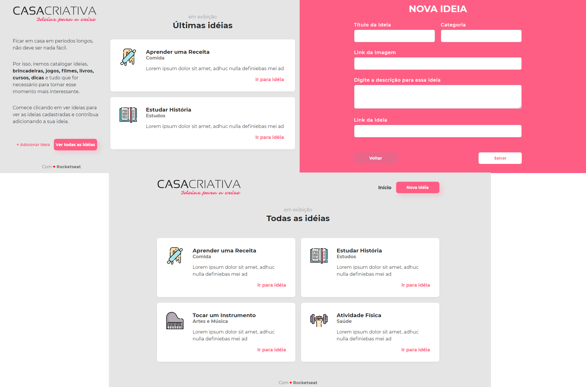

##   

### :construction: Em construção :hammer_and_wrench:  

Projeto desenvolvido no Workshop Dev com a equipe da [Rocketseat](https://rocketseat.com.br/)  :rocket:.  

Casa Criativa é uma plataforma de ajudar as pessoas no confinamento durante a pandemia do Covid-19.

  

As pessoas poderão dar idéias de formas de ocupar o tempo, indicando links de onde podem ter acesso aos conteúdos indicados como:  

1. atividades físicas;
2. estudos;
3. meditações;  

entre outros.  

_________________________________________________________________________

### :electron: Técnologias utilizadas  

* [Javascript](https://www.javascript.com/)
* [NodeJS](https://nodejs.org/)
* [Nunjucks](https://mozilla.github.io/nunjucks/)
* [Express](https://expressjs.com/)
* [SQLite3](https://www.sqlite.org/)  

_________________________________________________________________________

### :gear: Executando o projeto  

O projeto é dividido em duas partes:

* Back End
* Front End

Para inicializar o projeto:

1. _Clone este repositório_  
$ git clone https://github.com/harlemmuniz/casacriativa

2. _Acesse a pasta do projeto no terminal/cmd:_  
$ cd casacriativa

3. _Instale as dependências_  
$ npm install

4. _Execute a aplicação no modo desenvolvimento_  
$ npm run dev

5. _O servidor inciará na porta:3000_  

_A porta utilizada é 3000_ - acesse http://localhost:3000  

_________________________________________________________________________ 

:shield: Este projeto esta sob a licença MIT.